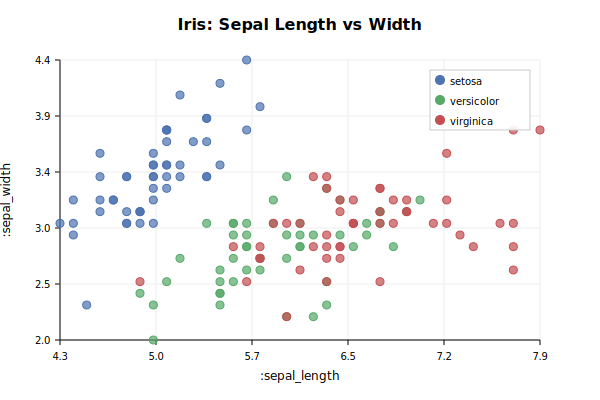
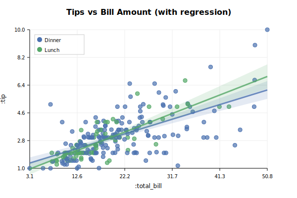
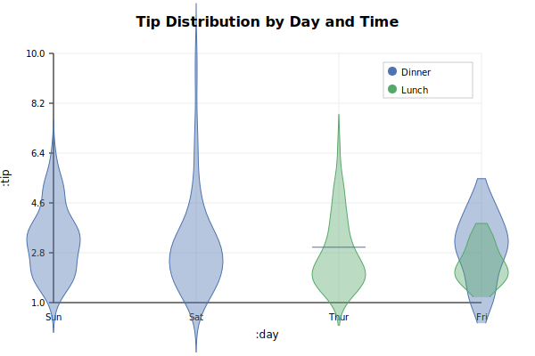
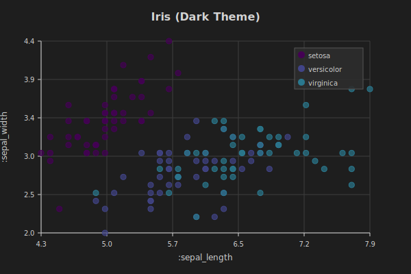
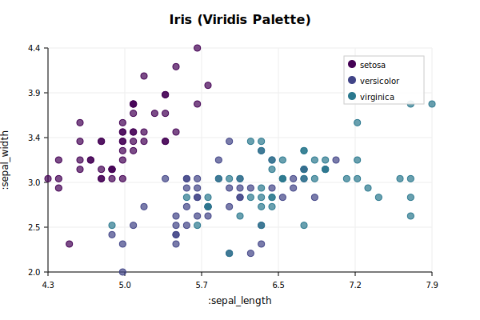
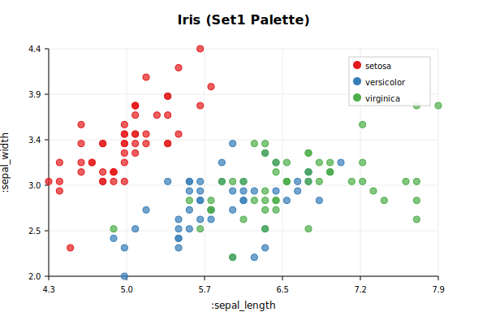
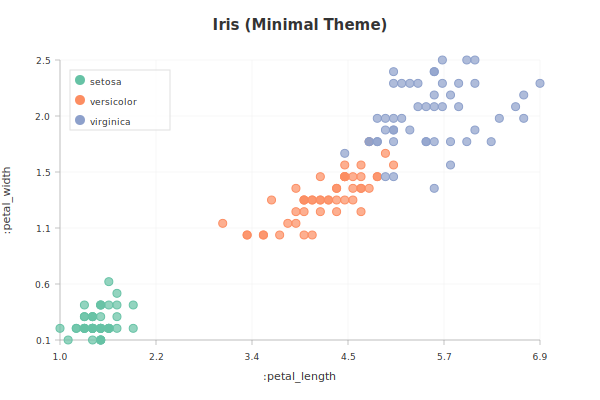

# drake
A high performance statistics plotting library for Emacs.

`drake` is a declarative plotting library for Emacs, inspired by Seaborn. It aims to provide high-quality statistical visualizations from DuckDB and SQLite data directly in Emacs.

**Quick Links:** [Gallery](docs/GALLERY.md) | [Theming Guide](docs/THEMING.md) | [Palette Browser](docs/PALETTE_BROWSER_QUICKSTART.md) | [Examples](examples/) | [Documentation](#documentation)

## Visual Showcase

<table>
<tr>
<td width="50%">

<p align="center"><em>Scatter plot with color grouping</em></p>
</td>
<td width="50%">

<p align="center"><em>Linear regression with confidence intervals</em></p>
</td>
</tr>
<tr>
<td width="50%">

<p align="center"><em>Violin plot with multiple categories</em></p>
</td>
<td width="50%">

<p align="center"><em>Dark theme support</em></p>
</td>
</tr>
</table>

**[View Full Gallery →](docs/GALLERY.md)**

## Status: Stage 5 (High Performance & Advanced Features)
- **Plot types:** Scatter, Line, Bar, Histogram, Box, Violin, and Linear Models (`drake-plot-lm`).
- **Features:** Grouping by color (`:hue`), automatic legends, categorical axes, statistical transformations (binning, OLS regression, summary stats), interactive tooltips, **native faceting**, **logarithmic scales**, and **date/time axes**.
- **Backends:**
  - **Native SVG (`svg`)**: Pure Elisp, zero dependencies.
  - **Gnuplot (`gnuplot`)**: High-quality SVG rendering via external `gnuplot`.
  - **Rust (`rust`)**: High-performance rendering for large datasets (10-13x faster than SVG).

## Backends

`drake` is backend-agnostic. You can switch backends using the `:backend` argument or by changing the default:

```elisp
;; Change the default backend globally
(setq drake-default-backend 'gnuplot)

;; Specify a backend for a single plot
(drake-plot-scatter :data iris :x :sepal_length :y :sepal_width :backend 'rust)
```

### Backend Priority

When multiple backends are loaded, `drake` respects the `drake-default-backend` variable (defaults to `'svg`). While there is no automatic switching between backends based on availability, the recommended order for performance and quality is:

1.  **`rust`**: Fastest rendering, ideal for datasets with >100,000 points. Requires compilation (see below).
2.  **`gnuplot`**: Excellent for high-quality static charts and complex types like Violins or Boxplots. Requires external `gnuplot` executable.
3.  **`svg`**: Best for portability and small-to-medium datasets. Works out-of-the-box in any Emacs with SVG support.

### The Rust Module

The `rust` backend provides a high-performance rendering engine built with the `plotters` crate. Use it when `svg` or `gnuplot` become slow with large datasets.

**Installation:**
To use the Rust backend, you must compile the dynamic module:
```elisp
(require 'drake-rust)
(drake-module-compile) ;; Requires CMake and Cargo/Rust
```

## Color Palettes

`drake` includes a comprehensive palette system with an interactive browser for exploring and managing colors.

### Palette Browser

Visually explore all available palettes with the interactive browser:

```elisp
M-x drake-palette-browser
```

**Browser Keyboard Shortcuts:**
- `RET`, `a` - Apply palette to current theme
- `c` - Copy palette name
- `f` - Fetch ColorBrewer palettes (100+)
- `s` - Search palettes by name
- `n`, `p` - Navigate next/previous
- `q` - Quit
- `?` - Help

**Quick commands:**
```elisp
;; Quick palette selection with completion
(drake-palette-browser-quick-select)

;; Preview a specific palette
(drake-palette-preview 'viridis)

;; Fetch additional palettes
M-x drake-fetch-palettes
```

### Built-in Palettes

Drake includes 13 built-in palettes organized by type:

**Sequential** (for ordered data - low to high values):
- `viridis` - Perceptually uniform, colorblind-friendly (default)
- `magma`, `plasma`, `inferno` - Perceptually uniform variants
- `blues` - Single-hue sequential

*Best for:* Heatmaps, choropleth maps, continuous values, temperature data

**Categorical** (for distinct, unordered groups):
- `set1` - Bright, high contrast colors
- `set2` - Softer, pastel colors
- `dark2` - Darker tones for light backgrounds
- `paired` - Pairs of related colors

*Best for:* Categories, regions, products, qualitative differences

**Diverging** (for data with a meaningful center point):
- `rdbu` - Red to blue
- `spectral` - Multi-color spectrum

*Best for:* Data above/below average, positive/negative values, gain/loss

### ColorBrewer Integration

Download 100+ additional professional palettes from ColorBrewer:

```elisp
M-x drake-fetch-palettes
```

Includes sequential (Blues, Greens, Oranges, etc.), diverging (BrBG, PiYG, RdYlGn, etc.), and qualitative (Accent, Pastel1, Set3, etc.) palettes. All palettes are cached locally at `~/.emacs.d/drake/palettes-cache.el` for offline use.

### Custom Palettes

Create and register your own color schemes:

```elisp
;; Register a custom palette
(drake-register-palette 'my-brand '("#1a5490" "#e84a27" "#f39c12"))

;; Use inline in any plot
(drake-plot-scatter :data data :x :x :y :y
                   :palette '("#ff0000" "#00ff00" "#0000ff"))

;; Export for sharing
(drake-palette-export 'viridis "my-palette.txt")

;; Import from file
(drake-palette-import "my-palette.txt" 'imported)
```

### Using Palettes

Palettes can be applied in three ways:

```elisp
;; 1. Explicit palette in plot
(drake-plot-scatter :data data :x :x :y :y :hue :category :palette 'viridis)

;; 2. Set as theme default (apply to all future plots)
(let ((theme (drake-get-current-theme)))
  (setf (drake-theme-palette theme) 'plasma))

;; 3. Theme automatically includes a default palette
(drake-set-theme 'dark)  ; Uses viridis by default
```

### Best Practices

**Choosing Palettes:**
- Match data type to palette type (sequential for ordered, categorical for groups)
- Use colorblind-friendly palettes (viridis, magma, plasma, inferno)
- Test in grayscale for print publications
- Use high-contrast palettes for presentations (set1, high-contrast theme)

**Accessibility:**
- ✓ Colorblind-friendly: viridis, magma, plasma, inferno, set2
- ✗ Avoid: Red-green combinations, rainbow palettes

**Palette Comparison:**

<table>
<tr>
<td width="50%">

<p align="center"><em>Viridis (colorblind-friendly)</em></p>
</td>
<td width="50%">

<p align="center"><em>Set1 (high contrast)</em></p>
</td>
</tr>
</table>

**Learn More:**
- [Palette Browser Quick Start](docs/PALETTE_BROWSER_QUICKSTART.md) - Get started in 60 seconds
- [Palette Demo](examples/palette-demo.el) - Interactive demonstrations

## Theming

Drake includes a comprehensive theming system that automatically adapts to your Emacs configuration:

```elisp
;; Automatically match your Emacs theme
(drake-auto-theme)

;; Or manually set a theme
(drake-set-theme 'dark)         ; Dark mode
(drake-set-theme 'light)        ; Light mode
(drake-set-theme 'minimal)      ; ggplot2-inspired
(drake-set-theme 'seaborn)      ; Seaborn-inspired
(drake-set-theme 'solarized-dark)  ; Solarized Dark

;; List all available themes
(drake-list-themes)

;; Preview a theme before applying
(drake-preview-theme 'dark)
```

**Built-in Themes:**
- `default` - Current default Drake style
- `light` - Clean, bright theme for light backgrounds
- `dark` - Professional dark theme (uses Viridis palette)
- `minimal` - ggplot2-inspired with subtle grids
- `seaborn` - Inspired by Python's Seaborn
- `high-contrast` - Maximum contrast for accessibility
- `solarized-light` / `solarized-dark` - Solarized color schemes

<table>
<tr>
<td width="50%">

<p align="center"><em>Dark theme</em></p>
</td>
<td width="50%">

<p align="center"><em>Minimal theme</em></p>
</td>
</tr>
</table>

**Custom Themes:**
```elisp
(defvar my-theme
  (make-drake-theme
   :name 'my-custom
   :background "#2e3440"
   :foreground "#d8dee9"
   :grid-color "#3b4252"
   :font-size 11
   :palette 'viridis))

(drake-set-theme my-theme)
```

Themes control colors, fonts, grid styles, and default palettes across all plot types and backends.

**Learn More:**
- [Theming Documentation](docs/THEMING.md) - Comprehensive theming guide
- [Theme Demo](examples/theme-demo.el) - Interactive demonstrations

## Org-Mode Integration

Drake seamlessly integrates with org-mode through org-babel, enabling statistical plotting directly in org documents, notebooks, and literate programming workflows.

### Quick Start

```elisp
;; Enable org-babel support
(with-eval-after-load 'org
  (require 'ob-drake)
  (org-babel-do-load-languages
   'org-babel-load-languages
   '((emacs-lisp . t)
     (drake . t))))
```

### Basic Usage

Execute Drake code in org source blocks:

```org
#+BEGIN_SRC drake :file scatter.svg
(drake-plot-scatter :data iris
                   :x :sepal_length
                   :y :sepal_width
                   :hue :species)
#+END_SRC
```

Press `C-c C-c` to execute. The plot appears inline automatically!

### Features

- **File output** - Plots save to `:file` parameter and create org links
- **Sessions** - Persistent environments with `:session` for multi-block workflows
- **Variable passing** - Share data between blocks with `:var`
- **Header arguments** - Control backend, theme, palette via block headers
- **Custom links** - Reference plots semantically with `[[drake:plot-id]]`
- **Export support** - Automatic conversion for HTML, LaTeX, Markdown
- **Quick templates** - Type `<drake` + TAB for instant code blocks

### Example Notebook

```org
#+TITLE: Iris Analysis

* Data Loading
#+BEGIN_SRC drake :session analysis
(setq iris-data (drake-load-csv "datasets/iris.csv.gz"))
#+END_SRC

* Visualization
#+BEGIN_SRC drake :session analysis :file figures/scatter.svg :theme dark
(drake-plot-scatter :data iris-data
                   :x :sepal_length
                   :y :sepal_width
                   :hue :species
                   :title "Iris Species Comparison")
#+END_SRC

#+RESULTS:
[[file:figures/scatter.svg]]
```

**Learn More:**
- [Org-Babel Guide](docs/ORG_BABEL_GUIDE.md) - Complete usage guide with examples
- [Org Integration Design](docs/ORG_INTEGRATION.md) - Technical implementation details

## Advanced Features

### Native Faceting (Small Multiples)
Create grids of plots based on categorical variables using `drake-facet`. All backends now use native rendering for optimal performance:

- **Gnuplot**: Uses `multiplot` layout for efficient grid rendering
- **Rust**: Uses plotters' native grid splitting for maximum performance
- **SVG**: Pure Elisp compositor for portability

```elisp
;; Column faceting
(drake-facet :data tips
            :col :time
            :plot-fn #'drake-plot-scatter
            :args '(:x :total_bill :y :tip)
            :backend 'rust)

;; Row and column faceting with overall title
(drake-facet :data tips
            :row :sex
            :col :time
            :plot-fn #'drake-plot-scatter
            :args '(:x :total_bill :y :tip)
            :title "Tips by Gender and Time"
            :backend 'gnuplot)
```

### Logarithmic Scales
Apply logarithmic scaling to either or both axes using `:logx` and `:logy`:

```elisp
;; Logarithmic X axis (useful for exponential data)
(drake-plot-scatter :data data :x :population :y :gdp :logx t)

;; Both axes logarithmic (for power-law relationships)
(drake-plot-scatter :data data :x :magnitude :y :frequency :logx t :logy t)

;; Works with hue grouping and regression
(drake-plot-lm :data data :x :dose :y :response :hue :treatment :logx t)
```

Logarithmic scales are supported across all backends (SVG, Gnuplot, Rust) and work with all plot types including scatter, line, bar, and regression plots.

### Date/Time Axes
Date and time data is automatically detected and formatted appropriately. Supports ISO 8601 format strings:

```elisp
;; Automatic detection from ISO 8601 timestamps
(drake-plot-line :data timeseries
                :x :timestamp  ; e.g., ["2026-01-01 00:00:00" "2026-02-01 00:00:00" ...]
                :y :temperature
                :backend 'rust)

;; Works with hue grouping for multiple time series
(drake-plot-line :data sensors
                :x :timestamp
                :y :reading
                :hue :sensor_id
                :backend 'svg)
```

**Note:** Date/time axes are fully supported in SVG and Rust backends. Gnuplot backend requires raw timestamp data (planned for future enhancement).

### Legend Placement
By default, `drake` intelligently places the legend in the emptiest corner of the plot. You can manually override this using the `:legend` argument:
```elisp
(drake-plot-scatter :data tips :x :total_bill :y :tip :hue :sex :legend 'bottom-left)
```
Supported values: `'top-right`, `'top-left`, `'bottom-right`, `'bottom-left`.

### Interactivity
Plots rendered with the `svg` or `gnuplot` backends include interactive tooltips. Hover your mouse over any data point to see its underlying values.

### Saving Plots
You can save any generated plot to an SVG file using `drake-save-plot`:
```elisp
(let ((plot (drake-plot-scatter :data iris :x :sepal_length :y :sepal_width)))
  (drake-save-plot plot "my-plot.svg"))
```

For plots displayed in a buffer, you can also use the interactive command **`M-x drake-save`** from that buffer to save it to a file. This works because `drake` stores the plot object in a buffer-local variable `drake-current-plot`.

## Data Formats

`drake` is optimized for **DuckDB** but supports any common Emacs data shape:
- **Columnar Plists:** `(:x [1 2 3] :y [10 20 30])` (Highest performance).
- **List of Lists (Row-based):** `((1 10) (2 20) (3 30))` (Use positional indices for `:x` and `:y`).
- **List of Alists/Plists:** `((:x 1 :y 10) (:x 2 :y 20))` (Keyword-based access).

## Sample Datasets

`drake` includes several well-known sample datasets in the `datasets/` directory (compressed as `.gz`):
- `iris.csv.gz`, `tips.csv.gz`, `gapminder.csv.gz`, `stocks.csv.gz`, etc.

## Usage

```elisp
(require 'drake)
(require 'drake-svg)

;; Scatter plot with grouping and linear regression
(drake-plot-lm :data iris :x :sepal_length :y :sepal_width :hue :species :title "Iris Regression")
```

## Running Examples

The `examples/` directory contains ready-to-run demonstrations:

**Basic Plotting:**
- [iris-scatter.el](examples/iris-scatter.el) - Basic scatter plot
- [tips-scatter.el](examples/tips-scatter.el) - Scatter with grouping
- [tips-regression.el](examples/tips-regression.el) - Linear regression
- [stage2-demo.el](examples/stage2-demo.el) - Comprehensive plot types

**Advanced Features:**
- [theme-demo.el](examples/theme-demo.el) - Theme system demonstrations
- [palette-demo.el](examples/palette-demo.el) - Palette browser and management
- [performance-bench.el](examples/performance-bench.el) - Benchmarking suite

## Documentation

**Core Documentation:**
- [README.md](README.md) - This file (getting started, features, API)
- [Gallery](docs/GALLERY.md) - Visual showcase of all plot types with examples
- [drake-spec.md](docs/drake-spec.md) - Original specification and design
- [TODO.md](TODO.md) - Roadmap and future features

**Feature Guides:**
- [THEMING.md](docs/THEMING.md) - Comprehensive theming system guide
- [PALETTE_BROWSER_QUICKSTART.md](docs/PALETTE_BROWSER_QUICKSTART.md) - Palette browser quick start
- [ORG_BABEL_GUIDE.md](docs/ORG_BABEL_GUIDE.md) - Org-mode integration and usage guide

**Design Documents:**
- [ORG_INTEGRATION.md](docs/ORG_INTEGRATION.md) - Org-babel integration design
- [AGGREGATION_DESIGN.md](docs/AGGREGATION_DESIGN.md) - Aggregation strategy and design philosophy
- [GAP_ANALYSIS.md](docs/GAP_ANALYSIS.md) - Feature gap analysis and future roadmap
- [RUST_EXPLORATION.md](docs/RUST_EXPLORATION.md) - Rust backend exploration and analysis

**Implementation Details:**
- [MATH_OFFLOAD_IMPLEMENTATION.md](docs/MATH_OFFLOAD_IMPLEMENTATION.md) - Rust math offload implementation
- [MATH_OFFLOAD_ANALYSIS.md](docs/MATH_OFFLOAD_ANALYSIS.md) - Performance analysis of math offloading
- [IMPLEMENTATION_SUMMARY.md](docs/IMPLEMENTATION_SUMMARY.md) - Stage 5 implementation summary

## Development

### Running Tests

You can run the full test suite using `ctest` from the `build` directory:

```sh
mkdir -p build && cd build
cmake ..
make check
```

Or run a specific test file using Emacs directly:

```sh
emacs -batch -L . -L tests -l tests/drake-tests.el -f ert-run-tests-batch-and-exit
```

### Running Benchmarks

Benchmarks are used to track performance regressions in data normalization, filtering, and rendering backends.

To run all benchmarks:

```sh
cd build
make bench
```

Individual benchmarks can be run via `ctest`:

```sh
cd build
ctest -L BENCHMARK --output-on-failure
```
