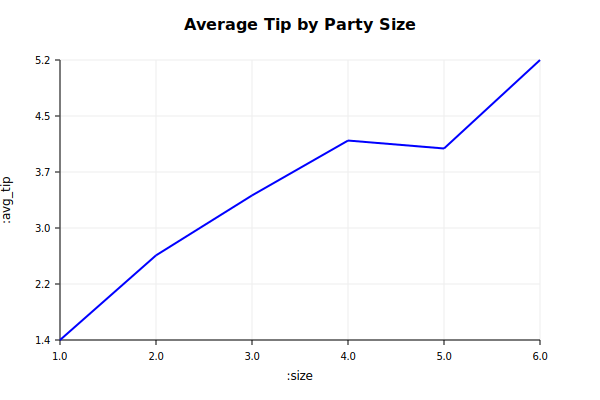
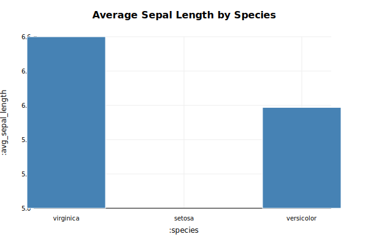
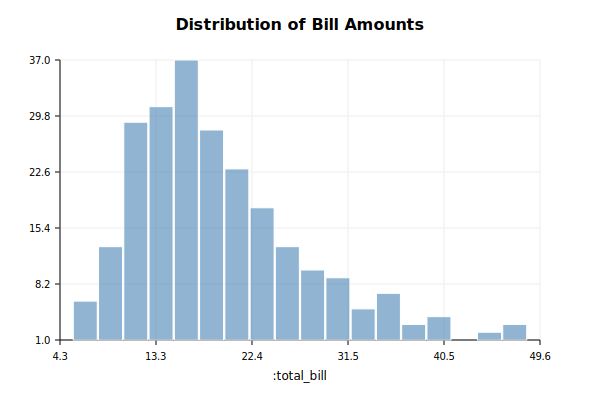
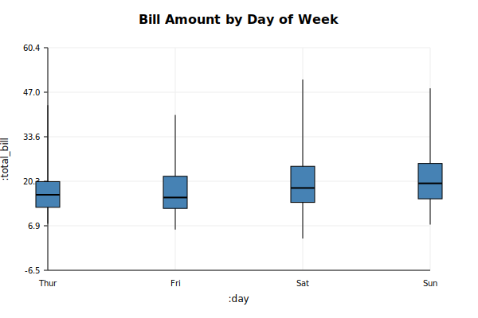
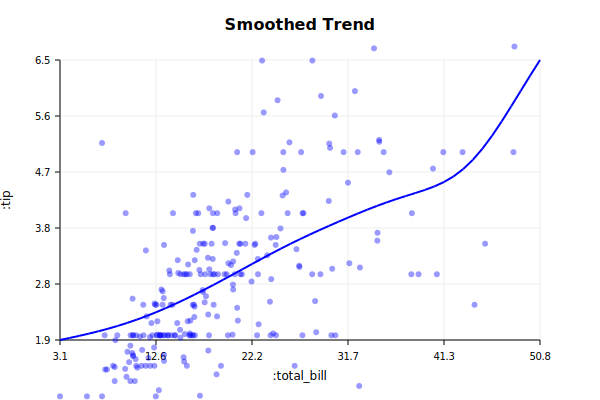
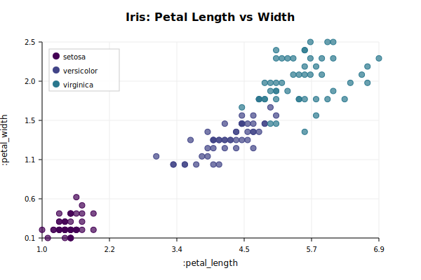
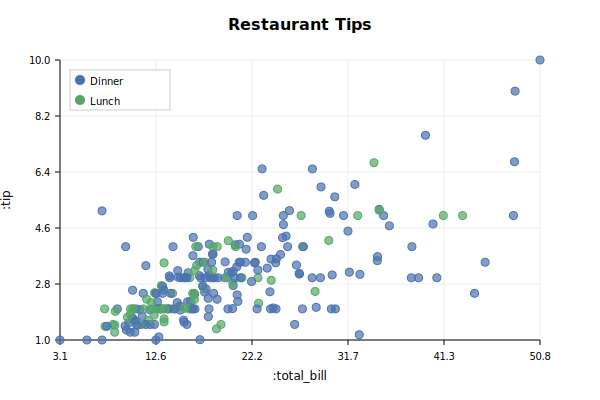

# Drake Plot Gallery

Visual showcase of Drake's plotting capabilities with example code.

## Table of Contents
- [Basic Plots](#basic-plots)
- [Statistical Plots](#statistical-plots)
- [Themes](#themes)
- [Color Palettes](#color-palettes)

---

## Basic Plots

### Scatter Plot

Simple scatter plot showing the relationship between two variables with color grouping.

```elisp
(drake-plot-scatter :data iris
                   :x :sepal_length
                   :y :sepal_width
                   :hue :species
                   :title "Iris: Sepal Length vs Width")
```


### Line Plot

Line plot showing trends across continuous or ordered data.

```elisp
(drake-plot-line :data data
                :x :size
                :y :avg_tip
                :title "Average Tip by Party Size")
```



### Bar Plot

Bar chart for comparing categorical data or aggregated values.

```elisp
(drake-plot-bar :data data
               :x :species
               :y :avg_sepal_length
               :title "Average Sepal Length by Species")
```



---

## Statistical Plots

### Histogram

Distribution visualization with automatic binning.

```elisp
(drake-plot-hist :data tips
                :x :total_bill
                :bins 20
                :title "Distribution of Bill Amounts")
```



### Box Plot

Show distribution quartiles and outliers across categories.

```elisp
(drake-plot-box :data tips
               :x :day
               :y :total_bill
               :title "Bill Amount by Day of Week")
```



### Violin Plot

Kernel density estimation combined with box plot features.

```elisp
(drake-plot-violin :data tips
                  :x :day
                  :y :tip
                  :hue :time
                  :title "Tip Distribution by Day and Time")
```


### Linear Regression

OLS regression with confidence intervals.

```elisp
(drake-plot-lm :data tips
              :x :total_bill
              :y :tip
              :hue :time
              :title "Tips vs Bill Amount (with regression)")
```


### Smooth Trend

Gaussian smoothing for trend visualization.

```elisp
(drake-plot-smooth :data tips
                  :x :total_bill
                  :y :tip
                  :title "Smoothed Trend")
```



---

## Themes

Drake includes multiple built-in themes that control the visual appearance of all plots.

### Dark Theme

Professional dark theme optimized for low-light environments.

```elisp
(drake-set-theme 'dark)
(drake-plot-scatter :data iris
                   :x :sepal_length
                   :y :sepal_width
                   :hue :species
                   :title "Iris (Dark Theme)")
```


### Minimal Theme

Clean, ggplot2-inspired theme with subtle grids.

```elisp
(drake-set-theme 'minimal)
(drake-plot-scatter :data iris
                   :x :petal_length
                   :y :petal_width
                   :hue :species
                   :title "Iris (Minimal Theme)")
```


---

## Color Palettes

Drake supports multiple color palettes optimized for different data types.

### Viridis Palette

Perceptually uniform, colorblind-friendly palette (default).

```elisp
(drake-plot-scatter :data iris
                   :x :sepal_length
                   :y :sepal_width
                   :hue :species
                   :palette 'viridis
                   :title "Iris (Viridis Palette)")
```


### Set1 Palette

High-contrast categorical palette for distinct groups.

```elisp
(drake-plot-scatter :data iris
                   :x :sepal_length
                   :y :sepal_width
                   :hue :species
                   :palette 'set1
                   :title "Iris (Set1 Palette)")
```


---

## More Examples

Additional plot types and variations:

### Petal Measurements

```elisp
(drake-plot-scatter :data iris
                   :x :petal_length
                   :y :petal_width
                   :hue :species
                   :palette 'viridis
                   :title "Iris: Petal Length vs Width")
```



### Tips Analysis

```elisp
(drake-plot-scatter :data tips
                   :x :total_bill
                   :y :tip
                   :hue :time
                   :title "Restaurant Tips")
```



---

## Running Examples

All example code and the image generation script are in the `examples/` directory:

- `examples/generate-images.el` - Script that generated these images
- `examples/iris-scatter.el` - Basic scatter plot example
- `examples/tips-scatter.el` - Scatter with grouping
- `examples/tips-regression.el` - Linear regression
- `examples/theme-demo.el` - Theme demonstrations
- `examples/palette-demo.el` - Palette browser demonstrations

## Learn More

- [README](../README.md) - Main documentation
- [Theming Guide](THEMING.md) - Complete theming documentation
- [Org-Babel Guide](ORG_BABEL_GUIDE.md) - Using Drake in org-mode
